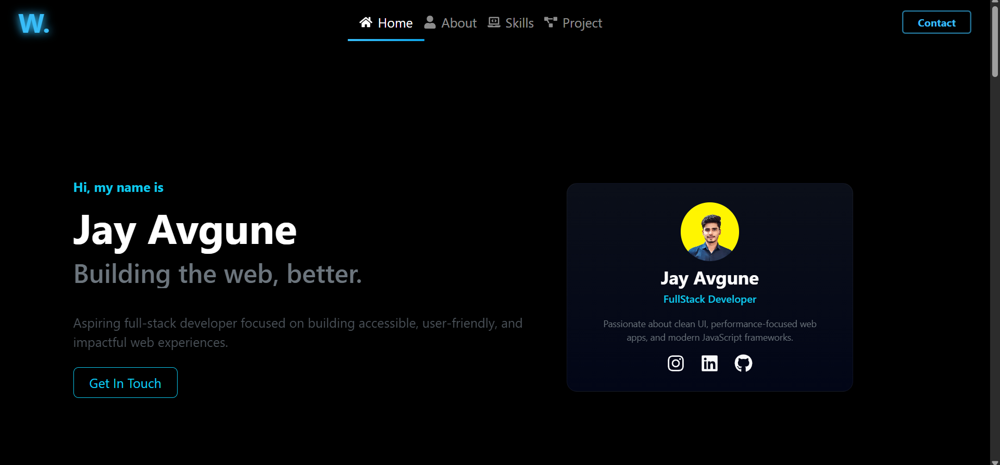
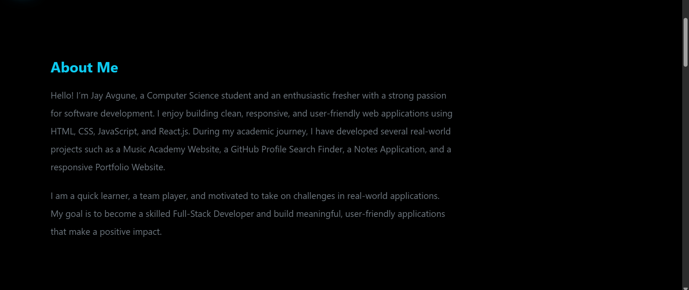
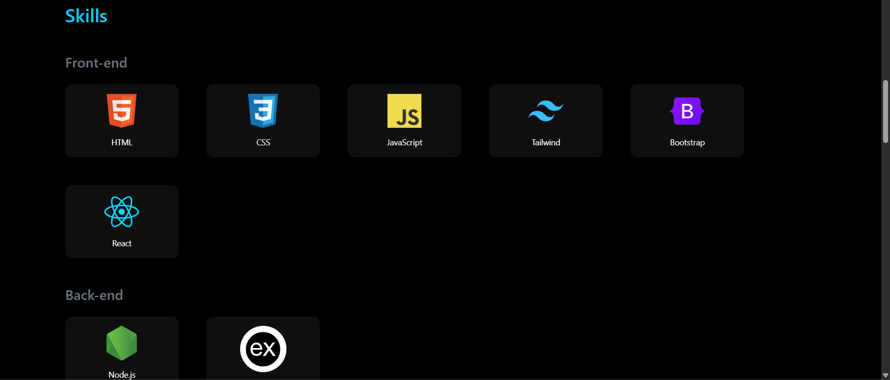
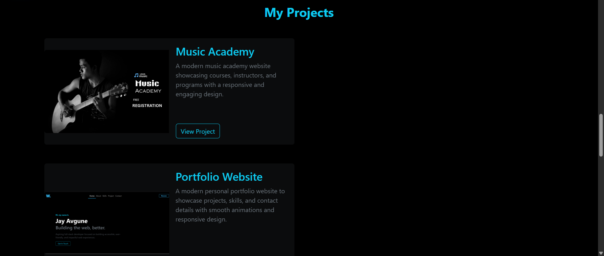

# 🌟 Jay Avgune Portfolio Website

Welcome to my **Personal Portfolio Website** repository! 🚀  
This project showcases my **skills, projects, and achievements**, built with modern web technologies and a clean, responsive design. Explore my work and see how I bring ideas to life! 🎨💻

---

## 🖥️ Live Demo

Check out the live portfolio here:  [🔗 View Portfolio](https://jay-avgune.netlify.app/)

---

## 📖 Table of Contents

1. [About the Project](#about-the-project)  
2. [Features](#features)  
3. [Technologies Used](#technologies-used)  
4. [Installation](#installation)  
5. [Screenshots](#screenshots)  
6. [Roadmap](#roadmap)  
7. [Contributing](#contributing)  
8. [Contact](#contact)  
9. [Acknowledgments](#acknowledgments)

---

## 📜 About the Project

This portfolio website is designed to:  

- **Showcase my skills** as a developer.  
- **Display my projects** with detailed descriptions and demos.  
- **Serve as a digital resume**, including contact info for professional outreach.  

Whether you're a recruiter, client, or fellow developer, I hope this portfolio inspires collaboration and engagement.

---

## ✨ Features

- **Dynamic Navigation** with smooth scrolling.  
- **Responsive Design** for all devices.  
- **Animated Sections** for an engaging user experience.  
- **Project Showcase** with live demos and GitHub links.  
- **Contact Form** with secure email submission.  
- **Clean and Minimalistic Design** with professional aesthetics.  

---

## 🛠️ Technologies Used

The portfolio is built with:  

- HTML5  
- CSS3 (with advanced animations)  
- JavaScript  
- React.js  
- TailwindCSS  

---

## 🛠️ Installation

To run this project locally, follow these steps:

1. Clone the repository:  
   ```bash
   git clone https://github.com/jayavgune18/portfolio-website
2. Navigate to the project directory:
   ```bash
   cd portfolio-website
   ```
3. Install dependencies:
   ```bash
   npm install
   ```
4. Start the development server:
   ```bash
   npm start
   ```
   The site will be available at `http://localhost:3000`.
   
   ---

## 📸 Portfolio Screenshots

### Landing Page


### About Section


### Skills Section


### Projects Section


### Contact Form


---

## 🚀 Roadmap

### Current Features
- Fully responsive design across all devices  
- Smooth animations for better user experience  
- Secure contact form handling  

### Upcoming Improvements
- Dark mode toggle 🌙 for a comfortable viewing experience  
- Blog section 📝 to share tutorials and insights  
- Multilingual support 🌎 to reach a wider audience  

---

## 📬 Contact

Feel free to reach out to me:

- **Email:** [jayavgune18@gmail.com](mailto:jayavgune18@gmail.com)  
- **LinkedIn:** [Connect with me](https://www.linkedin.com/in/jay-avgune/)  
   

